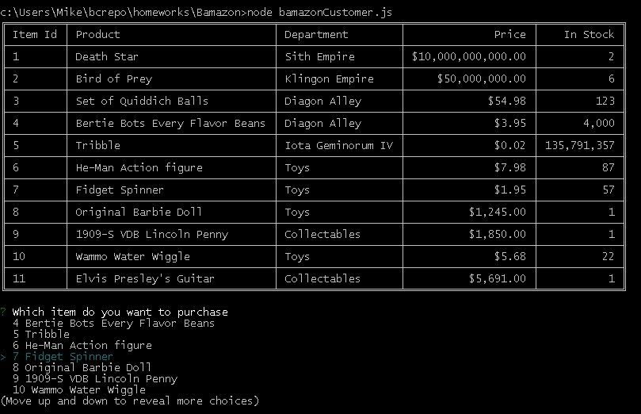
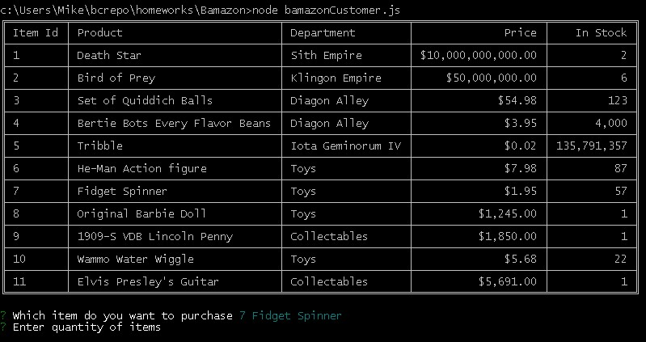
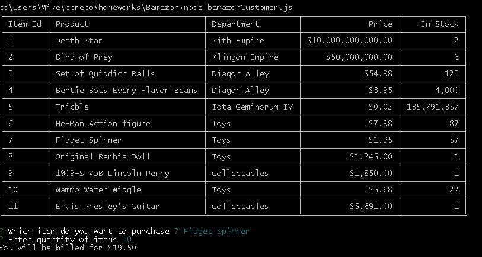
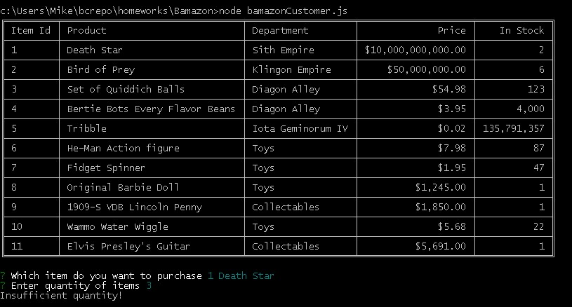

# Bamazon
A node.js and mysql project to track sales across departments.

### How it works
From the command line enter node bamazonCustomer.js
The following screen appears:

From that will drop under the cursor, choose the product you want to order, then choose the quantity.

You will be shown the total cost of the order.

If you attempt to order more than the quantity on hand, an error message will be displayed.

In the screen above the number of Fidget Spinners is 10 less than the previous screens, reflecting our previous order.